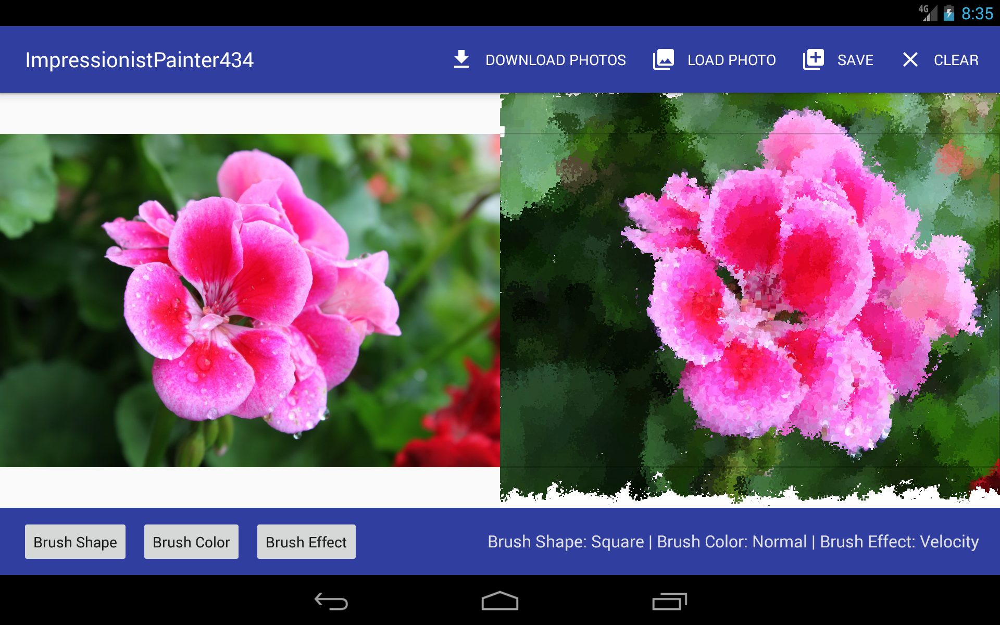
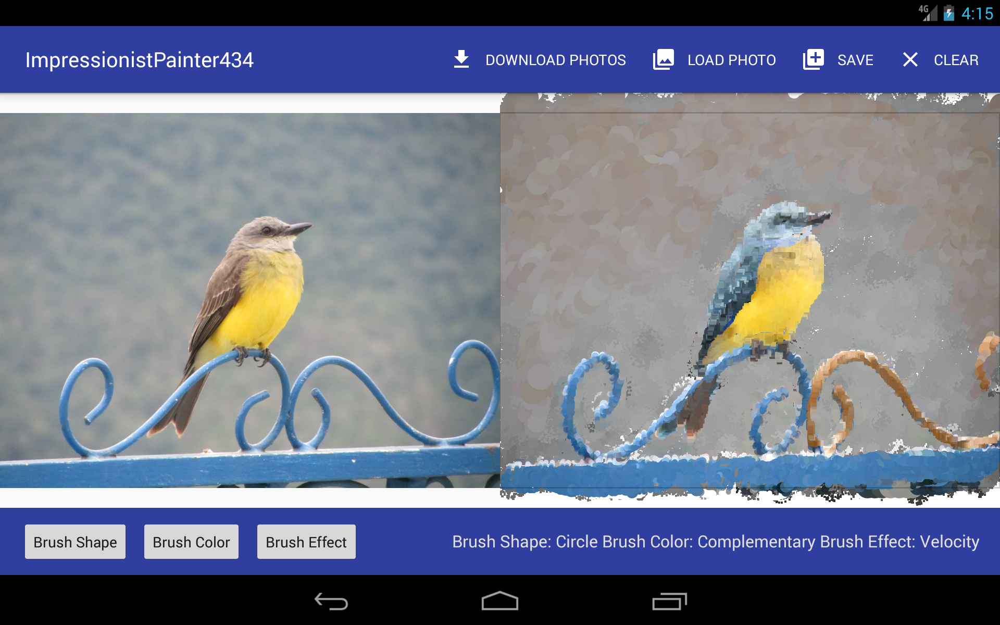
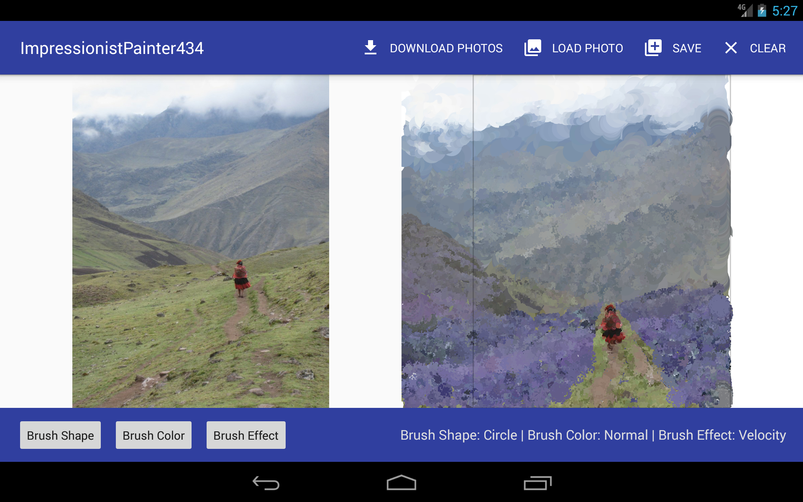

# IA 09 Impressionist Paiter
CMSC434 Fall 2016 | Victor De Souza

**Quickly and easily paint Impressionist Art:** Load a photo from the gallery, choose your brush settings and paint with your finger. Impressionist Painter will get the color of the pixel from the photo that corresponds to  when you touch on the canvas. Combine brush shapes, color, and effects to easily create a work of art.

 

*Impressionist style painting done with a combination of brush shapes and the velocity effect.*

### Up to 27 painting modes

__Brush Shape:__ Choose *circle*, *square*, or *spray* brush shapes to paint with.

__Brush Color:__ *Normal color mode* will extract the same color as the photo. *Grayscale color mode* can be used to paint in black and white. *Complementary color mode* will convert corresponding color to the complement color.

__Brush Effect:__ *No effect* will paint the brush as normal at a default brush size. *Velocity mode* will adjust the brush size based on the speed of your finger on the screen. *Accelerometer mode* works similarly to velocity mode however, the painting happens when the device is tilted and rotated.

*Impressionist painting using complementary color mode to give the bird, background, and fence a new look.*

 *Impressionist painting using complementary color mode and spray brush to paint a new field of flowers. Circle brush with velocity mode is used to paint the fog and clouds above the mountains*

__Online resources used in this app:__

- Using the accelerometer for painting: https://developer.android.com/reference/android/hardware/SensorManager.html
- Calculating change of speed in velocity mode and painting history of movement for smoother brush strokes: https://developer.android.com/training/gestures/movement.html
- Getting color from a pixel and computing its grayscale and complementary colors: http://stackoverflow.com/a/14920800 and http://serennu.com/colour/rgbtohsl.php
- Create random spray brushes:  http://gamedev.stackexchange.com/a/26714